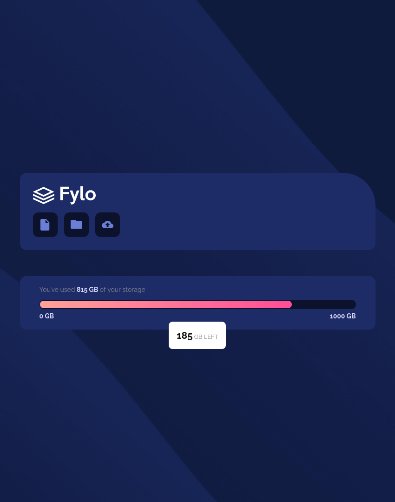

# Frontend Mentor - Fylo Data Storage Component 

Fylo data storage component design from the website Frontend Mentor.

https://www.frontendmentor.io/challenges/fylo-data-storage-component-1dZPRbV5n

I made this with more advanced CSS by using some properties that I never used them before. I googled a lot and I found the following here: css-tricks.com.

1) ::after : The ::after pseudo-elements in CSS allows you to insert content onto a page without it needing to be in the HTML.

2) :nth-child : The :nth-child selector allows you to select one or more elements based on their source order, according to a formula. 

3) em instead of rem : As Jeremy Church said: While em is relative to the font-size of its direct or nearest parent, rem is only relative to the html (root) font-size.

4) object-fit: The object-fit property defines how an element responds to the height and width of its content box. It’s intended for images, videos and other embeddable media formats in conjunction with the object-position property. 

This is the preview I made:

Desktop version:

Mobile version:

Live: https://zer0fr0st93.github.io/Fylo-Data-Storage/